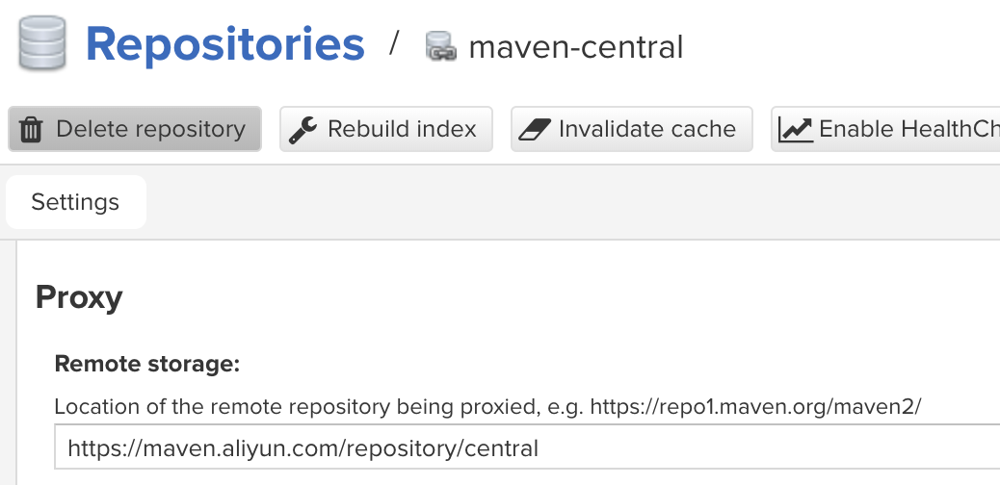
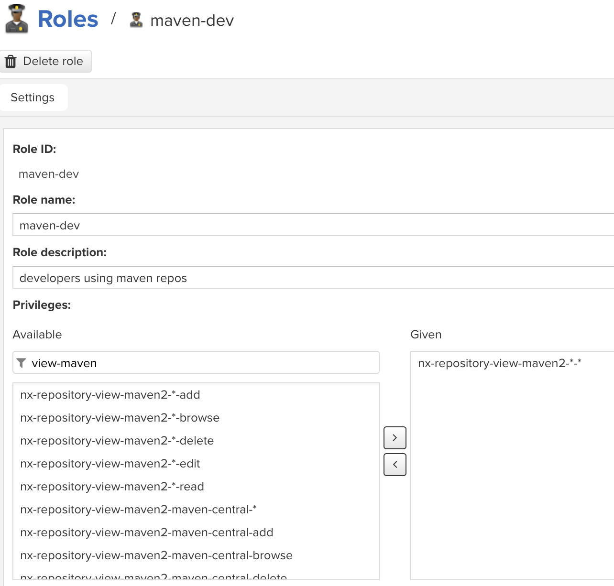
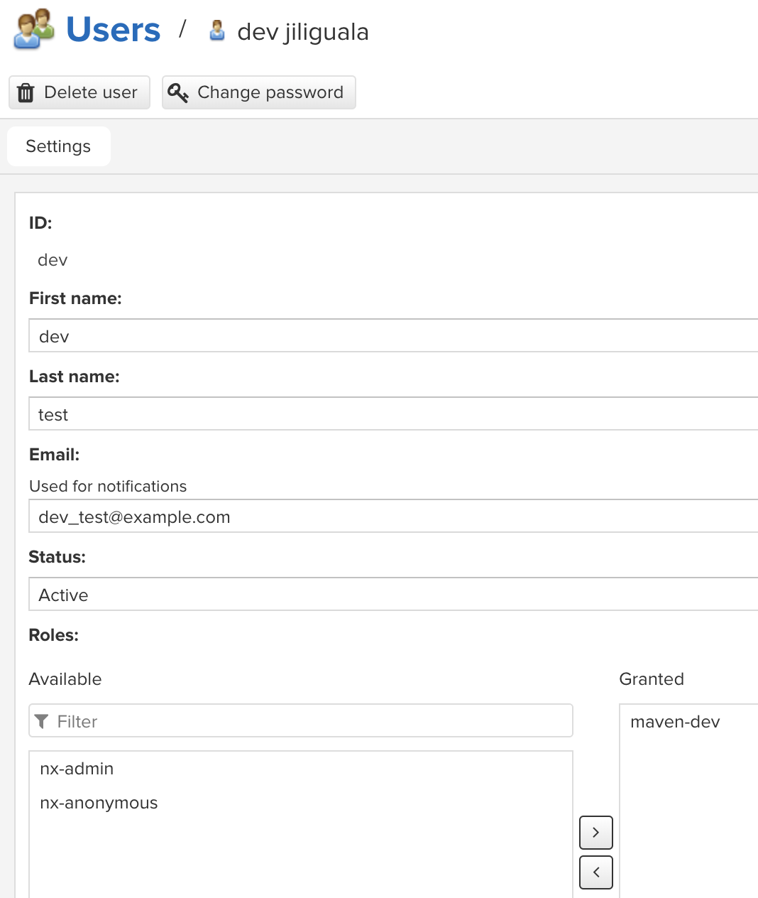

# Private Repository Management Using Nexus

## Deployment and Configuration

### Quick Start

1. 启动服务：

    在此目录下执行：

    ```sh
    mkdir nexus-data
    docker-compose up -d
    ```

    使用默认的 docker-compose 配置， Nexus 的服务将会在 8081 端口监听，数据会被存储在当前目录下的 `nexus-data` 文件夹。

1. 找到默认管理员密码：

    ```sh
    docker exec -it nexus cat /nexus-data/admin.password
    ```

    复制它。

1. 打开 [Nexus 主页](http://localhost:8081) （默认是 http://localhost:8081 ），以管理员身份登录，账号 admin ，密码为刚才复制的。之后会提示更改默认管理员密码和是否允许匿名访问，选择不允许。

1. 进入 [仓库管理页面](http://localhost:8081/#admin/repository/repositories) ，可以看到已经有 `maven-central`, `maven-releases`, `maven-snapshots` 和 `maven-public` 这几个 repo 。其中， `maven-public` 是一个包含了其它 repo 的 group 。

1. `maven-central` 类型是 proxy ，是 Maven 中央仓库的代理，具有缓存功能。将 `Remote storage` 改为 https://maven.aliyun.com/repository/central （阿里云的镜像）：
    

1. `maven-releases` 和 `maven-snapshots` 类型是 `hosted` ，即该 Nexus 服务自己管理的 Maven repo 。可以作为团队的私有仓库。

1. 创建具有 Maven 仓库读写权限的角色（ Role ）：在左侧 `Security` 菜单下的 [Roles 页面](http://localhost:8081/#admin/security/roles)  ，点击 `Create role` ，在 `Privileges` 里选上 `nx-repository-view-maven2-*-*` ：
    

1. 创建一个公用的开发人员账户（ User ）：在左侧 `Security` 菜单下的 [Users 页面](http://localhost:8081/#admin/security/users) ，点击 `Create local user` ，`Roles` 设置为刚才创建的角色：

    

### Advanced Settings

TODO:

1. Blob

1. Privileges

1. Docker registry

## Repository Usage

### User-level Maven Settings

在用户的 Maven 的配置文件 `～/m2/settings.xml` 中：

1. 在 `servers` 标签里，加入一个 `server` 配置（用于 deploy 到私有仓库）。

1. 在 `mirrors` 标签里，加入一个 `mirror` 配置（用于下载私有 Maven Central 镜像和私有仓库的包）。

```xml
<settings xmlns="http://maven.apache.org/SETTINGS/1.0.0"
  xmlns:xsi="http://www.w3.org/2001/XMLSchema-instance"
  xsi:schemaLocation="http://maven.apache.org/SETTINGS/1.0.0
                      http://maven.apache.org/xsd/settings-1.0.0.xsd">
  ...
  <servers>
    <server>
      <id>mycompany-maven</id>
      <username>dev</username>
      <password>testdev</password>
      <!-- <privateKey>${user.home}/.ssh/id_dsa</privateKey>
      <passphrase>some_passphrase</passphrase> -->
      <filePermissions>664</filePermissions>
      <directoryPermissions>775</directoryPermissions>
      <configuration></configuration>
    </server>
  </servers>
  <mirrors>
    <mirror>
      <id>mycompany-maven</id>
      <name>MyCompany Maven Mirror</name>
      <mirrorOf>*</mirrorOf>
      <url>http://repository.mycompany.com/repository/maven-public/</url>
    </mirror>
  </mirrors>
  ...
</settings>
```

### Project-level Maven Settings

在 Maven 项目的 `pom.xml` 中的 `distributionManagement` 标签里，加入 `repository` 和 `snapshotRepository` 配置：

```xml
<project xmlns="http://maven.apache.org/POM/4.0.0"
  xmlns:xsi="http://www.w3.org/2001/XMLSchema-instance"
  xsi:schemaLocation="http://maven.apache.org/POM/4.0.0
                      http://maven.apache.org/xsd/maven-4.0.0.xsd">
  <modelVersion>4.0.0</modelVersion>
  ...
  <distributionManagement>
     <repository>
      <id>mycompany-maven</id>
      <name>MyCompany Maven Release Repository</name>
      <url>http://repository.mycompany.com/repository/maven-releases/</url>
    </repository>
    <snapshotRepository>
      <id>mycompany-maven</id>
      <name>MyCompany Maven Snapshot Repository</name>
      <url>http://repository.mycompany.com/repository/maven-snapshots/</url>
    </snapshotRepository>
  </distributionManagement>
  ...
</project>
```

### Test Settings

可以使用当前目录下的 `my-app` 项目来测试设置是否生效。修改 `pom.xml` 中 `distributionManagement` 标签下的 url 为实际值，然后执行：

```sh
mvn deploy
sed -i "" "s/1.0-SNAPSHOT/1.0/" pom.xml
mvn deploy
```

测试是否能成功从私有镜像下载依赖，以及部署到私有仓库（包括 releases 和 snapshots ）。
